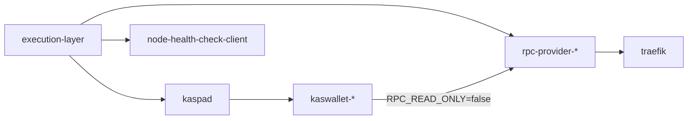

# Debug: Service Restarts And Dependency Exits

Use this guide when a service unexpectedly exits, keeps restarting, or appears to hang while waiting for another component.

## What Controls Restart Behavior

There are two layers involved:

1. `scripts/lib/watch-dependencies.sh`
   This wrapper waits for declared dependencies before starting the real process. If a dependency disappears later, it stops the child process and exits with status `1`.

2. Docker restart policy
   Most core services in `docker-compose.yml` use `SERVICE_RESTART_POLICY`.

Default behavior by environment:

- Mainnet: `SERVICE_RESTART_POLICY=unless-stopped`
- Galleon testnet: `SERVICE_RESTART_POLICY=unless-stopped`
- Dev: `SERVICE_RESTART_POLICY=no`

Two services currently pin `restart: unless-stopped` directly in Compose:

- `node-health-check-client`
- `atan-uploader`

## Dependency Map



## Restart Frontend Without Touching Backend

`frontend-w*` profiles do not need to activate backend services directly. For a full stack start, bring up both profiles:

```bash
docker compose --profile backend --profile frontend-w5 up -d --no-build
```

If backend is already running and you only want to bounce frontend services, restart the frontend profile directly:

```bash
docker compose --profile frontend-w5 restart
```

To remove and recreate frontend containers without touching backend:

```bash
docker compose --profile frontend-w5 down
docker compose --profile frontend-w5 up -d --no-build
```

For fewer workers, replace `frontend-w5` with `frontend-w1` through `frontend-w4`.

This works because `kaspad` and `execution-layer` are not part of the `frontend-w*` profile set, so profile-scoped `restart` and `down` only target frontend services.

## Quick Triage

### 1. Check current container state

```bash
docker compose ps
```

This tells you whether the container is currently `Up`, `Exited`, or flapping.

### 2. Check whether Docker actually restarted it

```bash
docker inspect -f 'name={{.Name}} restart_count={{.RestartCount}} status={{.State.Status}} exit_code={{.State.ExitCode}} started={{.State.StartedAt}} finished={{.State.FinishedAt}} error={{.State.Error}}' rpc-provider-0
```

Interpretation:

- `restart_count=0` with `status=running`: the container has not restarted yet
- `restart_count=0` with `status=exited`: it exited and stayed down
- `restart_count>0`: Docker restarted the same container at least once

### 3. Read recent logs with timestamps

```bash
docker compose logs --timestamps --since 30m rpc-provider-0
docker compose logs --timestamps --since 30m kaspad
docker compose logs --timestamps --since 30m traefik
```

Use `-f` if you want to keep watching:

```bash
docker compose logs --timestamps --since 10m -f rpc-provider-0 traefik
```

### 4. Check Docker restart events

```bash
docker events --since 30m --filter container=rpc-provider-0
```

This helps confirm whether Docker restarted the container or whether it simply stayed up and kept polling for dependencies.

## How To Tell What Happened

### Service is waiting for a dependency

Typical signals:

- `docker compose ps` shows the container as `Up`
- `restart_count=0`
- logs repeatedly show `[watch-dependencies] ... unavailable ...`
- you do not see the real application startup logs yet

This means the wrapper is still running and the child command has not started.

### Service exited and stayed down

Typical signals:

- `docker compose ps` shows `Exited`
- `restart_count=0`
- logs end with a dependency-loss message from `watch-dependencies.sh`

This is expected when restart policy is `no`.

### Service restarted after an error

Typical signals:

- `restart_count>0`
- logs contain an earlier failure, then a fresh startup sequence later
- `docker events` shows restart-related lifecycle events

This is expected on mainnet for services using `SERVICE_RESTART_POLICY=unless-stopped`.

## Are Logs Persistent After Restart

Yes, in the current default setup they are.

The environment examples set:

```bash
LOGGING_DRIVER=json-file
```

With the `json-file` driver:

- `docker logs` and `docker compose logs` continue to show earlier log lines after a restart of the same container
- the log stream is appended across restarts of that container
- log rotation still applies because Compose sets `max-size`, `max-file`, and `compress`

Important distinction:

- Restarted container: same container, logs remain visible via `docker logs`
- Recreated container: new container ID, old logs stay attached to the old container until it is removed

To compare container identity:

```bash
docker inspect -f 'id={{.Id}} created={{.Created}} started={{.State.StartedAt}}' rpc-provider-0
```

If you switch to `LOGGING_DRIVER=syslog`, persistence depends on the host logging system instead of Docker's `json-file` storage.

## Common Signatures

### `[watch-dependencies] execution-layer is unavailable at execution-layer:8545`

Meaning:

- the wrapper could not reach the execution layer TCP endpoint

What to check:

```bash
docker compose ps
docker compose logs --timestamps --since 15m execution-layer
docker inspect -f 'restart_count={{.RestartCount}} status={{.State.Status}}' execution-layer
```

### `[watch-dependencies] rpc-backends has no healthy endpoints in ...`

Meaning:

- none of the configured RPC health URLs responded successfully

What to check:

```bash
docker compose ps
docker compose logs --timestamps --since 15m rpc-provider-0 rpc-provider-1 traefik
```

Note:

- `traefik` uses `--http-any`, so only one healthy RPC backend is required
- if you run `watch-dependencies.sh` manually from the host shell, Docker-internal names like `rpc-provider-0` only work if they resolve from your current network context

### `[watch-dependencies] missing command`

Meaning:

- the wrapper was invoked directly without `-- command ...`

Correct pattern:

```bash
./scripts/lib/watch-dependencies.sh -- /bin/true
```

### Repeated dependency messages every few seconds

Meaning:

- the wrapper is still polling and has not started the child process yet

The poll interval is controlled by:

```bash
DEPENDENCY_CHECK_INTERVAL_SECONDS
```

Optional timeout knobs:

```bash
DEPENDENCY_TCP_TIMEOUT_SECONDS
DEPENDENCY_HTTP_TIMEOUT_SECONDS
```

## Recommended Debug Flow

When a service looks unhealthy:

1. Run `docker compose ps`
2. Inspect `RestartCount` and state timestamps
3. Read recent logs with `--timestamps --since ...`
4. Check the upstream service named in the `watch-dependencies` message
5. Use `docker events` if you need to confirm actual restart behavior

For example, if `rpc-provider-0` is failing:

```bash
docker compose ps
docker inspect -f 'restart_count={{.RestartCount}} status={{.State.Status}} started={{.State.StartedAt}} finished={{.State.FinishedAt}}' rpc-provider-0
docker compose logs --timestamps --since 15m rpc-provider-0 execution-layer kaswallet-0
docker events --since 15m --filter container=rpc-provider-0
```

## Related Docs

- [Log Management](../log-management.md)
- [Mainnet Deployment Guide](../quick-setup-mainnet.md)
- [Galleon Testnet Deployment Guide](../quick-setup-galleon-testnet.md)
