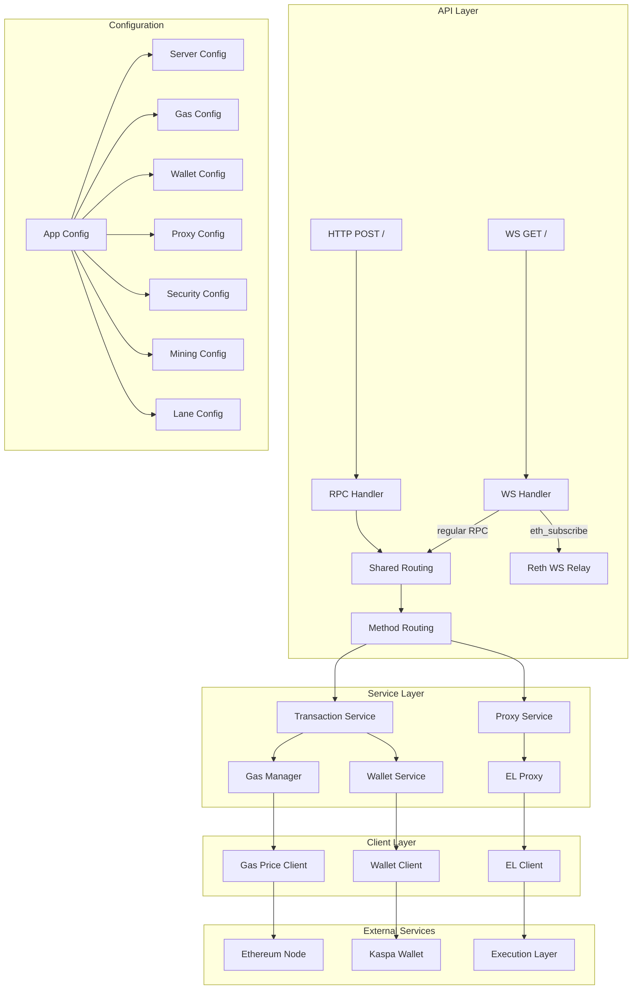
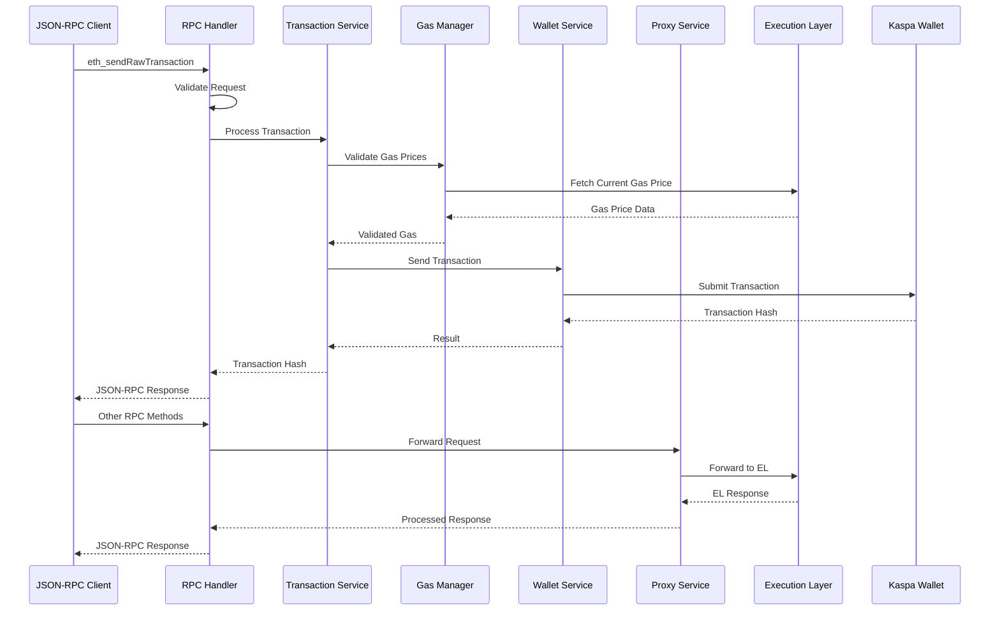
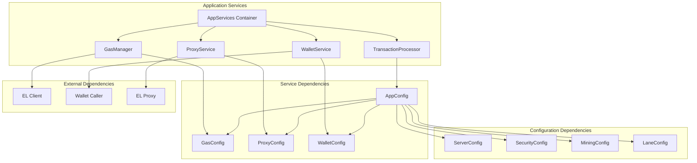
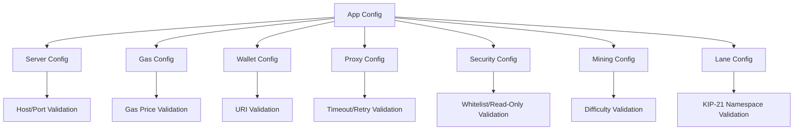
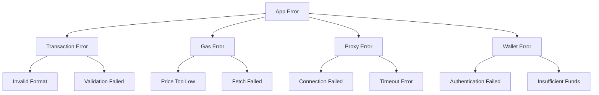

# IGRA RPC Provider Architecture Documentation

## Overview

The IGRA RPC Provider is a JSON-RPC proxy service designed with Domain-Driven Design (DDD) principles and Single Responsibility Principle (SRP). It acts as a bridge between Ethereum-compatible clients and the Kaspa blockchain, providing transaction processing, gas management, and proxy services.

## Architecture Principles

### 1. Domain-Driven Design (DDD)
- **Clear Domain Boundaries**: Each service has a single, well-defined responsibility
- **Domain-Specific Language**: Each domain uses its own error types and configuration
- **Separation of Concerns**: Business logic is separated from infrastructure concerns

### 2. Single Responsibility Principle (SRP)
- **Service Isolation**: Each service handles one aspect of the system
- **Clean Dependencies**: Services depend only on what they need
- **Testability**: Services can be tested in isolation

### 3. Clean Architecture
- **Layered Design**: Clear separation between API, Service, and Client layers
- **Dependency Injection**: Services are composed through dependency injection
- **Configuration Management**: Domain-specific configuration with validation

## System Architecture

### Current Architecture (After Refactoring)

### Service Interaction Flow

### Dependency Graph

## Domain Structure

### 1. API Layer (`src/api/`)
**Responsibility**: Handle HTTP and WebSocket requests
- `routing.rs`: Shared routing logic — single source of truth for validation, method dispatch, and logging (used by both HTTP and WS handlers)
- `rpc.rs`: HTTP JSON-RPC request handler (POST /)
- `ws.rs`: WebSocket handler (GET / with upgrade) — subscriptions relay to reth WS, regular RPC calls go through shared routing
- `health.rs`: Health check endpoint
- Request validation (whitelist, read-only mode) and error formatting

### 2. Service Layer (`src/services/`)
**Responsibility**: Business logic and domain operations

#### Transaction Processing (`transaction_processor.rs`)
- Single responsibility: Process Ethereum transactions
- Coordinates between gas validation and wallet operations
- Handles transaction queuing and sequential processing

#### Gas Management (`gas_manager.rs`)
- Single responsibility: Gas price calculation and validation
- EIP-1559 support with dynamic gas pricing
- Gas price floor enforcement

#### Proxy Service (`proxy.rs`)
- Single responsibility: Forward requests to Execution Layer
- Handle EL-specific transformations
- Manage connection and retry logic

#### Wallet Service (`wallet_service.rs`)
- Single responsibility: Wallet operations and communication
- Abstract wallet implementation details
- Handle transaction submission and status

### 3. Configuration Layer (`src/config/`)
**Responsibility**: Domain-specific configuration management

### 4. Error Handling (`src/errors/`)
**Responsibility**: Domain-specific error types and handling

## Key Design Decisions

### 1. Service Dependency Injection
- **AppServices Container**: Centralized service creation and management
- **Clean Construction**: Services are created with their dependencies injected
- **Testing Support**: Mock services can be injected for testing

### 2. Configuration Management
- **Domain Separation**: Each domain has its own configuration struct
- **Validation**: Configuration is validated at startup
- **Backward Compatibility**: Helper methods maintain existing API

### 3. Error Handling Strategy
- **Domain-Specific Errors**: Each domain defines its own error types
- **Conversion Pattern**: Domain errors are converted to API errors
- **Rich Error Information**: Errors include context and suggestions

### 4. Async Architecture
- **Tokio Integration**: Full async/await support throughout
- **Non-blocking**: All I/O operations are asynchronous
- **Efficient Resource Usage**: Proper Arc/Mutex patterns for shared state

## Testing Strategy

### 1. Unit Testing
- **Service Isolation**: Each service can be tested independently
- **Mock Dependencies**: Services accept mock implementations
- **Domain Testing**: Each domain has comprehensive test coverage

### 2. Integration Testing
- **End-to-End Flows**: Full RPC request/response cycles
- **Service Interaction**: Test service collaboration
- **Error Handling**: Verify error propagation and formatting

### 3. Configuration Testing
- **Validation Testing**: Test configuration validation logic
- **Default Values**: Verify default configuration behavior
- **Edge Cases**: Test boundary conditions and invalid inputs

## Performance Considerations

### 1. Request Processing
- **Asynchronous Processing**: All operations are non-blocking
- **Connection Pooling**: Reuse connections to external services
- **Caching Strategy**: Gas prices and configuration are cached

### 2. Memory Management
- **Arc/Mutex Pattern**: Shared ownership without data races
- **Efficient Cloning**: Configuration and state are cheaply cloneable
- **Resource Cleanup**: Proper cleanup of resources and connections

### 3. Error Handling Performance
- **Zero-Cost Abstractions**: Error handling doesn't impact happy path
- **Efficient Conversions**: Domain to API error conversion is lightweight
- **Structured Logging**: Rich logging without performance impact

## Security Considerations

### 1. Request Validation
- **Method Whitelist**: Only allowed RPC methods are processed via SecurityConfig
- **Read-Only Mode**: When enabled, blocks all write operations (eth_sendRawTransaction, personal_*, admin_*)
- **Input Validation**: All input parameters are validated
- **Gas Price Enforcement**: Minimum gas price floor enforcement on eth_gasPrice

### 2. Configuration Security
- **Sensitive Data Protection**: No secrets in configuration files
- **Validation**: All configuration is validated before use
- **Secure Defaults**: Default configuration values are secure

### 3. Service Isolation
- **Error Isolation**: Errors in one service don't affect others
- **Resource Isolation**: Each service manages its own resources
- **Dependency Isolation**: Services have minimal dependencies

## Monitoring and Observability

### 1. Structured Logging
- **Contextual Logging**: Each request has tracking context
- **Performance Metrics**: Request duration and throughput
- **Error Tracking**: Comprehensive error logging with context

### 2. Health Checks
- **Health Endpoint**: `GET /health` verifies EL connectivity by calling `eth_blockNumber`
- **Service Health**: Each service can report its health status
- **Dependency Health**: Monitor external service dependencies
- **Configuration Health**: Validate configuration at runtime

### 3. Metrics and Alerting
- **Performance Metrics**: Request rates, response times, error rates
- **Business Metrics**: Transaction success rates, gas price trends
- **System Metrics**: Memory usage, CPU utilization, connection pools

## Future Enhancements

### 1. Enhanced Testing
- **Mock Framework**: Implement comprehensive mocking framework
- **Property-Based Testing**: Add property-based tests for edge cases
- **Performance Testing**: Add load testing and benchmarking

### 2. Advanced Features
- **Circuit Breaker**: Implement circuit breaker pattern for external services
- **Retry Logic**: Enhanced retry logic with exponential backoff
- **Metrics Export**: Export metrics to external monitoring systems

### 3. Operational Improvements
- **Dynamic Configuration**: Support for runtime configuration updates
- **Graceful Shutdown**: Implement graceful shutdown for all services

## Conclusion

This architecture provides a solid foundation for maintainable, testable, and scalable RPC proxy service. The clear separation of concerns, domain-driven design, and dependency injection patterns make it easy to understand, modify, and extend the system while maintaining backward compatibility with existing clients.